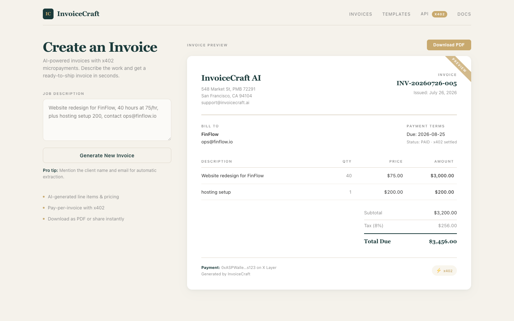

# InvoiceCraft: natural-language invoices, paid per call via x402

Describe a job in plain English, pay 0.50 USDT on X Layer, and get back a structured invoice plus a ready-to-send PDF. No account, no subscription.

[](https://www.python.org/)
[](https://fastapi.tiangolo.com/)
[](LICENSE)
[]()



---

## What is InvoiceCraft?

InvoiceCraft is an Agent Service Provider for OKX.AI. It turns a one-sentence job description into a formatted invoice with line items, quantities, tax, and totals, then returns a downloadable PDF. Billing is pay-per-call: each invoice costs 0.50 USDT, settled on X Layer through the x402 protocol. Send zero invoices, pay zero.

---

## Features

- **Natural-language input**: parse a plain description into structured line items with quantities and rates.
- **Pay-per-invoice**: 0.50 USDT per call via x402, no subscription.
- **On-chain settlement**: payments settle in USDT on X Layer (`eip155:196`).
- **Wallet payment in the UI**: connect OKX Wallet or MetaMask and pay directly from the demo dashboard.
- **PDF output**: professional invoice rendered with ReportLab, returned as base64.
- **Replay-safe challenges**: each payment challenge is single-use and expires after 15 minutes.
- **Stateless by design**: no accounts, no login. SQLite holds only challenges and the invoice counter.

---

## Quick start

```bash
git clone <repo> && cd InvoiceCraft
pip install -r requirements.txt

export ASP_WALLET=0xYourWallet
export INVOICE_ISSUER_NAME="Your Name"
export INVOICE_ISSUER_EMAIL="you@example.com"

python3 -m uvicorn app.main:app --reload
```

Open http://localhost:8000/ for the demo dashboard (the app serves it on the same origin as the API). Or POST directly to `/api/v1/invoice`.

By default the service runs in demo mode: payment verification is mocked and parsing uses the built-in heuristic. See [Configuration](#configuration) to enable real on-chain verification and LLM parsing.

---

## How it works

1. **POST a job description** to `/api/v1/invoice`. The server responds with `402 Payment Required` and a payment challenge (`challenge_id`, receiver address, amount, and X Layer chain details).
2. **Pay 0.50 USDT** on X Layer to the receiver address. In the demo UI, click Connect Wallet and Pay. From the API, send the transfer with any X Layer wallet.
3. **Re-POST** with `description`, `payment_tx_hash`, and `challenge_id`. The server verifies the payment, then returns the invoice JSON and a base64-encoded PDF.

---

## API reference

### `POST /api/v1/invoice`

**Request** (first call, no payment):
```json
{ "description": "Website redesign for FinFlow, 40 hours at 75/hr, plus hosting setup 200" }
```

**402 response** (payment required):
```json
{
  "error": "payment_required",
  "message": "Pay 0.50 USDT on X Layer to generate invoice",
  "payment": {
    "amount": "0.50",
    "token": "USDT",
    "chain": "eip155:196",
    "chain_id": "0xc4",
    "receiver": "0x...",
    "challenge_id": "abc123...",
    "memo": "abc123...",
    "token_contract": "",
    "decimals": 6,
    "rpc_url": ""
  }
}
```

**Request** (second call, after payment):
```json
{
  "description": "Website redesign for FinFlow, 40 hours at 75/hr, plus hosting setup 200",
  "payment_tx_hash": "0x...",
  "challenge_id": "abc123..."
}
```

**200 response**:
```json
{
  "invoice": {
    "issuer": { "name": "...", "address": "0x...", "email": "..." },
    "client": { "name": "...", "email": "..." },
    "line_items": [
      { "description": "Website redesign for FinFlow", "quantity": 40, "unit_price": "75.00", "amount": "3000.00" },
      { "description": "hosting setup", "quantity": 1, "unit_price": "200.00", "amount": "200.00" }
    ],
    "invoice_number": "INV-20260726-001",
    "subtotal": "3200.00",
    "tax_rate": "0.08",
    "tax_amount": "256.00",
    "total": "3456.00",
    "currency": "USD",
    "due_date": "2026-08-25",
    "status": "paid",
    "notes": "Payment: 0x... on X Layer"
  },
  "pdf": "<base64>"
}
```

**Validation**: `description` must be 10 to 2000 characters. `challenge_id` is required when `payment_tx_hash` is provided.

`GET /health` reports the active `payment_mode` and whether AI parsing is enabled.

---

## Configuration

| Variable | Default | Purpose |
|---|---|---|
| `ASP_WALLET` | (required) | Receiver address for payments, shown as the issuer on the invoice |
| `PAYMENT_VERIFY_MODE` | `mock` | `mock` accepts any well-formed tx hash (demo/dev). `onchain` verifies a real USDT transfer on X Layer |
| `XLAYER_RPC` | (unset) | X Layer RPC URL, required for `onchain` mode |
| `USDT_CONTRACT` | (unset) | USDT token address on X Layer, required for `onchain` mode |
| `MIN_CONFIRMATIONS` | `1` | Confirmations required in `onchain` mode |
| `LLM_API_KEY` | (unset) | Anthropic API key. Enables LLM line-item parsing, falls back to the heuristic parser when unset |
| `LLM_MODEL` | `claude-sonnet-5` | Model used for parsing |
| `TAX_RATE` | `0.08` | Tax rate as a decimal |
| `DB_PATH` | temp dir | SQLite path (used when Upstash is not configured) |
| `UPSTASH_REDIS_REST_URL` | (unset) | Upstash Redis REST URL — enables durable persistence across restarts |
| `UPSTASH_REDIS_REST_TOKEN` | (unset) | Upstash Redis REST token (required with the URL above) |
| `LLM_API_STYLE` | `anthropic` | `anthropic` or `openai` (for DeepSeek/OpenRouter/OpenCode) |
| `LLM_API_URL` | provider default | Chat/messages endpoint for the chosen style |
| `LLM_MAX_TOKENS` | `4096` | Token budget (keep high for reasoning models) |

---

## How it works (architecture)

```
Browser (dashboard) ──POST──> FastAPI app (app/main.py)
                                 │
                                 ├─ parse ──> LLM (app/ai_parser.py)
                                 │            or heuristic (app/invoice.py)
                                 ├─ verify ─> x402 (app/x402.py)
                                 │            mock, or web3 -> X Layer
                                 ├─ render ─> ReportLab (app/pdf_engine.py)
                                 └─ state ──> SQLite (app/store.py)
```

- **FastAPI** exposes a single invoice endpoint and serves the demo dashboard from the same origin.
- **Parsing** uses an LLM when `LLM_API_KEY` is set. Without a key, a heuristic parser handles hourly rates and flat amounts.
- **x402 verification** issues single-use challenges. In `onchain` mode it confirms a USDT transfer to the receiver via web3.
- **ReportLab** renders the invoice PDF.
- **SQLite** persists challenges and the daily invoice counter, so state survives restarts and stays consistent across workers.

| File | Role |
|---|---|
| `app/main.py` | FastAPI app, routes, static dashboard mount |
| `app/invoice.py` | Description parsing, invoice creation, numbering |
| `app/ai_parser.py` | LLM-based line-item extraction |
| `app/pdf_engine.py` | ReportLab PDF layout and rendering |
| `app/x402.py` | Payment challenge generation and verification |
| `app/store.py` | SQLite persistence for challenges and counter |
| `app/tax.py` | Configurable tax rate |
| `app/models.py` | Pydantic request/response models |

---

## Sponsor integrations

- **OKX.AI**: InvoiceCraft is built as an Agent Service Provider, listed on the OKX.AI marketplace.
- **x402**: pay-per-call billing. Each invoice costs 0.50 USDT, collected before the PDF is generated.
- **X Layer (`eip155:196`)**: payments settle in USDT on X Layer. On-chain mode verifies the transfer directly via web3.
- **OKX Agentic Wallet**: users pay from the dashboard by connecting a wallet, or from any wallet that supports X Layer USDT transfers.

---

## Running the tests

```bash
python3 -m pytest -q
```

31 tests cover description parsing, tax and totals, PDF generation, the x402 challenge lifecycle, and the full request/response flow.

---

## Project structure

```
InvoiceCraft/
├── app/             # FastAPI application
│   ├── main.py      # Routes + dashboard mount
│   ├── invoice.py   # Parsing + invoice assembly
│   ├── ai_parser.py # LLM line-item extraction
│   ├── x402.py      # Payment challenges + verification
│   ├── pdf_engine.py# PDF rendering
│   ├── store.py     # SQLite persistence
│   ├── tax.py       # Tax rate
│   └── models.py    # Pydantic models
├── dashboard/       # Demo UI (served at /)
├── tests/           # pytest suite
├── docs/images/     # Screenshots
├── Dockerfile       # Production container
├── render.yaml      # Render deploy config
└── requirements.txt
```

---

## License

MIT
