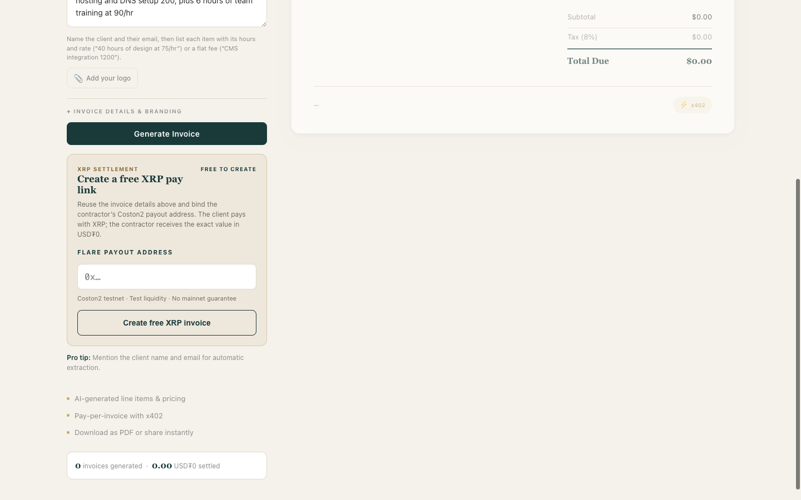
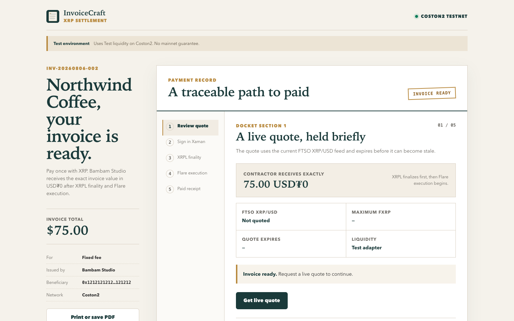
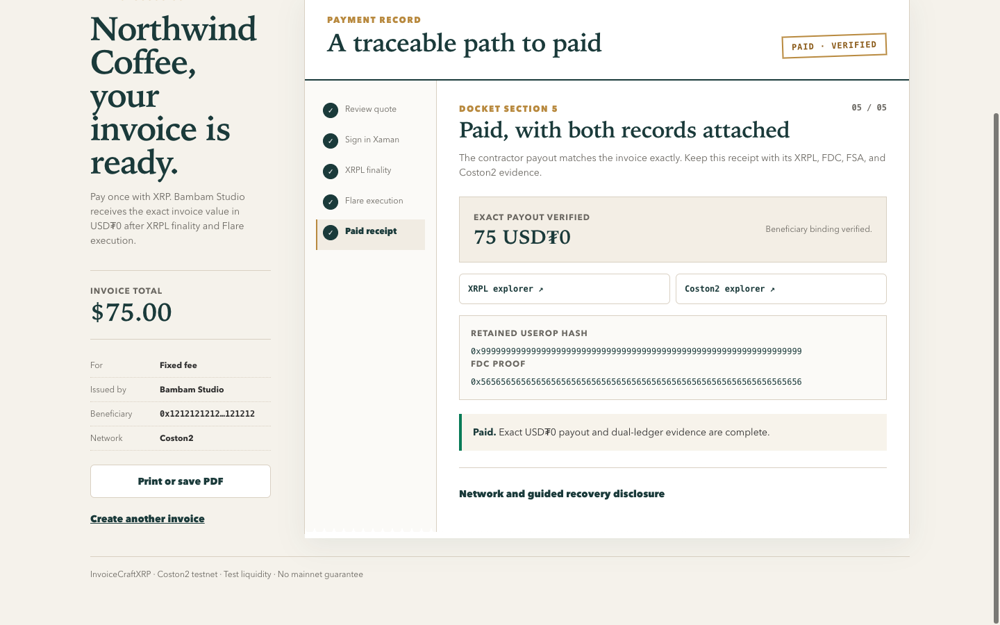

# InvoiceCraftXRP

InvoiceCraftXRP extends InvoiceCraft with free, persistent XRP invoice links.
The payer signs an XRPL Testnet Payment, while the invoice targets an exact
USD₮0 payout on Coston2 through FAssets and FSA.

[](https://www.python.org/)
[](https://fastapi.tiangolo.com/)
[](https://soliditylang.org/)
[](#tests)
[](LICENSE)


## Contents

- [Current proof status](#current-proof-status)
- [Screenshots](#screenshots)
- [Existing and new work](#existing-before-bounty-1-and-new-for-bounty-1)
- [XRP settlement flow](#what-the-xrp-path-does)
- [Live protocol evidence](#live-protocol-evidence)
- [Contract addresses](#contract-addresses)
- [Architecture](#architecture)
- [Sponsor technology](#sponsor-technology)
- [Tech stack](#tech-stack)
- [Setup](#setup)
- [Environment variables](#environment-variables)
- [API reference](#api-reference)
- [Tests](#tests)
- [Wallet test setup](#wallet-test-setup)
- [Demo](#demo)
- [Recovery rules](#recovery-rules)
- [Project structure](#project-structure)
- [Deployment](#deployment)
- [Security notes](#security-notes)
- [License](#license)

## Current proof status

The repository keeps protocol, deployment, and product-settlement evidence in
separate machine-readable records.

| Capability | Current evidence |
| --- | --- |
| Free XRP invoice API and persistent `/pay/<id>` link | Implemented and covered by API tests |
| Selected Settlement Docket UI | Browser-reviewed at 1440x900 and 390x844 |
| Live FTSO and FAssets parameter reader | Implemented with bounded, pinned Coston2 RPC calls |
| XRPL Payment plus retained `0xFE` UserOp | Live XRPL Testnet transaction and tests |
| FSA direct mint | Live Coston2 protocol-spike transaction, RPC revalidated |
| Canonical test assets | FXRP and faucet USD₮0 metadata verified by Coston2 RPC |
| Keyless Coston2 operator queue | Implemented, browser-reviewed, and covered by API and live-adapter tests |
| `InvoiceSettlement` and `TestLiquidityAdapter` | Deployed on Coston2 with bindings, caps, label, and bytecode checked by RPC |
| Exact product USD₮0 payout | Live 5 USD₮0 settlement, validated against Coston2 RPC |
| Xaman device opening | Approved on an iPhone 12 Pro against XRPL Testnet |

The protocol smoke record reuses the authorized Phase 0 transactions and proves
the XRP Payment, FDC binding, retained UserOp, and Coston2 direct mint. Separate
records cover the deployed contracts and the later product settlement, including
the exact beneficiary transfer through the labelled test adapter.

## Screenshots

| Creator payout binding | Payer docket |
| --- | --- |
|  |  |



The receipt screenshot uses a deterministic local fixture to show the completed
UI state. The live protocol evidence is listed separately below; the screenshot
is not evidence of a product payout.

## Existing before Bounty 1 and new for Bounty 1

| Existing before Bounty 1 | New for Bounty 1 |
| --- | --- |
| Natural-language invoice generation | Free persisted XRP invoice resource |
| PDF invoice output | Persistent `/pay/<id>` share link |
| Legacy x402 payment gate on X Layer | Live FTSO and FAssets quote with expiry and input cap |
| Existing InvoiceCraft dashboard and x402 wallet flow | Xaman Testnet signing request with exact unsigned fallback |
| Existing invoice, PDF, parser, and x402 tests | Retained `0xFE` UserOp and FDC-bound executor model |
|  | `InvoiceSettlement` and labelled `TestLiquidityAdapter` contracts |
|  | Dual-ledger receipt and fail-closed recovery classification |
|  | Settlement Docket creator, payer, receipt, and recovery UI |

The new work preserves `/api/v1/invoice` and the legacy x402 dashboard. It adds
the XRP path beside them instead of replacing them.

## What the XRP path does

1. A contractor creates a USD or USD₮0 invoice and binds a Coston2 beneficiary.
2. InvoiceCraft stores the invoice and returns a shareable `/pay/<id>` URL.
3. The payer requests a 120-second quote built from current FTSO and FAssets
   data. The committed settlement has a separate 15-minute FDC execution deadline.
4. The server builds an XRPL Payment to the current Core Vault. Its `0xFE` memo
   commits to the complete PackedUserOperation.
5. Xaman opens the Testnet signing request. If Xaman is unavailable, the exact
   unsigned transaction remains visible.
6. The server verifies finalized XRPL fields and replay protection, then creates
   a keyless operator job. The local settlement desk prepares exact FDC and
   direct-mint requests; Chrome performs every wallet approval.
7. A successful product settlement produces a receipt for the
   `XRP→FXRP→USD₮0` path with both explorer hashes and the exact beneficiary amount.

XRPL and Coston2 finalize as separate ledger events. Recovery is guided only.
The service never claims that it can reverse a wrong destination or move funds
automatically.

## Live protocol evidence

The following transactions were produced during the authorized Phase 0
protocol spike and revalidated through bounded RPC requests on 6 August 2026.

| Network | Transaction | What it proves |
| --- | --- | --- |
| XRPL Testnet | [1CBE730F...F788CC](https://testnet.xrpl.org/transactions/1CBE730F2C98A858DA769C654BB2CD3B2F7F5DB2165BE0AAA76A11D654F788CC) | Successful Payment to the queried Core Vault with the committed `0xFE` memo |
| Coston2 | [0x9b1622...fa1b6](https://coston2-explorer.flare.network/tx/0x9b16227528c10af0f5ec4e46018d9f9dabe5af6235dfb8955d6932f4bf3fa1b6) | Successful `executeDirectMintingWithData` call and matching UserOperation execution |
| Coston2 FDC request | [0x955205...edec](https://coston2-explorer.flare.network/tx/0x9552053f15c27f99ab7177243ceeb32b2b46021ea7d88f181ed8cf990050edec) | FDC attestation request used by the protocol proof |

The machine-readable records are
[`evidence/protocol-spike.json`](evidence/protocol-spike.json) and
[`evidence/coston2-smoke.json`](evidence/coston2-smoke.json). The current public
asset snapshot is [`evidence/coston2-assets.json`](evidence/coston2-assets.json).

## Contract addresses

| Contract | Coston2 address | Status |
| --- | --- | --- |
| AssetManagerFXRP | [`0xc1ca88b937d0b528842f95d5731ffb586f4fbdfa`](https://coston2-explorer.flare.network/address/0xc1ca88b937d0b528842f95d5731ffb586f4fbdfa) | Queried from the official Flare registry at the proof block |
| MasterAccountController | [`0x434936d47503353f06750db1a444dbdc5f0ad37c`](https://coston2-explorer.flare.network/address/0x434936d47503353f06750db1a444dbdc5f0ad37c) | Queried during the protocol spike |
| FXRP (`FTestXRP`) | [`0x0b6a3645c240605887a5532109323a3e12273dc7`](https://coston2-explorer.flare.network/token/0x0b6a3645c240605887a5532109323a3e12273dc7) | Registry-resolved token; 6 decimals and bytecode verified at block `0x2027844` |
| Faucet USD₮0 test | [`0xc1a5b41512496b80903d1f32d6dea3a73212e71f`](https://coston2-explorer.flare.network/token/0xc1a5b41512496b80903d1f32d6dea3a73212e71f) | `USDT0 test` / `USD₮0`; 6 decimals and bytecode verified at block `0x2027844` |
| `InvoiceSettlement` | [`0x4b66cd0139513d0f2f2f6268de46ae07725799e4`](https://coston2-explorer.flare.network/address/0x4b66cd0139513d0f2f2f6268de46ae07725799e4) | Deployed at block 33737526; FXRP, USD₮0, and adapter bindings verified |
| `TestLiquidityAdapter` | [`0x047e7665816b3788a2efb6b49ee6d1967e8261af`](https://coston2-explorer.flare.network/address/0x047e7665816b3788a2efb6b49ee6d1967e8261af) | Funded with 10 USD₮0 test; paid 5 USD₮0 in the validated product settlement |

The test adapter identifies itself as `TEST LIQUIDITY - NOT A REAL COSTON2
MARKET`. It has a per-settlement output cap, total output cap, deadline check,
single settlement authorization, and exact-output transfer.

[`evidence/product-deployment.json`](evidence/product-deployment.json) binds the
deployment transaction, bytecode, contract getters, canonical token metadata,
and funding transfer. The separate payout receipt is
[`evidence/product-settlement-smoke.json`](evidence/product-settlement-smoke.json).

## Architecture

```text
Contractor browser
  |
  +--> POST /api/v1/xrp/invoices
  |      |
  |      +--> SQLite or Upstash persistence
  |
  +--> share /pay/<id> with payer
         |
         +--> Coston2 FTSO + FAssets parameter quote
         +--> Xaman Testnet request or unsigned XRPL Payment
         +--> finalized XRPL and FDC verification
         +--> FSA direct mint of FXRP
         +--> InvoiceSettlement
                 |
                 +--> TestLiquidityAdapter
                         |
                         +--> exact USD₮0 to beneficiary
```

The server stores the complete UserOp, quote binding, transaction hash, FDC
evidence, execution result, and receipt. Transaction claims and execution locks
make retries idempotent.

## Sponsor technology

| Technology | Load-bearing use |
| --- | --- |
| FAssets / FXRP | XRP-backed asset entering the settlement contract |
| FSA `0xFE` | XRPL memo authorization for the later Flare call |
| FDC | Proof of the finalized XRPL Payment |
| FTSO | Expiring XRP/USD quote and FXRP input cap |
| USD₮0 | Exact contractor payout denomination on Coston2 |

## Tech stack

| Layer | Technology |
| --- | --- |
| API | Python 3.11+, FastAPI, Pydantic |
| Persistence | SQLite by default, optional Upstash Redis |
| Dashboard | Static HTML, CSS, and JavaScript served by FastAPI |
| PDF | ReportLab |
| XRPL and EVM RPC | Strict standard-library JSON-RPC clients plus web3 for legacy x402 |
| Contracts | Solidity 0.8.25 and Foundry |
| Tests | pytest and Foundry |
| Existing deployment config | Render |

## Setup

### Prerequisites

- Python 3.11 or newer
- Foundry for Solidity tests
- A browser for the dashboard
- Xaman only for an authorized XRPL Testnet device test

### Install

```bash
git clone https://github.com/ajanaku1/invoicecraft.git
cd invoicecraft

python3 -m venv .venv
source .venv/bin/activate
pip install -r requirements.txt
cp .env.example .env
```

Never put an XRPL seed, EVM private key, or recovery phrase in `.env`. The live
protocol helper prepares transactions for explicit wallet approval. It does not
read private keys.

For the existing x402 endpoint, set `ASP_WALLET`. Keep
`PAYMENT_VERIFY_MODE=mock` for local development. Set it to `onchain` only with
the correct X Layer RPC and token address.

The free XRP invoice creator does not require payment credentials. Xaman API
credentials are optional; without them, the signing endpoint returns the exact
unsigned transaction fallback.

### Run

```bash
python3 -m uvicorn app.main:app --reload
```

Open [http://127.0.0.1:8000](http://127.0.0.1:8000). Create the invoice in the
XRP settlement card, then open the generated pay link.

The application wires the live payment preparer, trusted XRPL reader, and
browser-operated FDC/FSA queue only when every required public contract binding
and `XRP_OPERATOR_TOKEN` are configured. It resolves the payer's FSA personal
account and nonce live; no wallet key is accepted or stored. Configuration alone
does not prove settlement; use the checked-in RPC-validated receipt as evidence.

## Environment variables

Copy [`.env.example`](.env.example) and fill only the services you use.

| Group | Variables |
| --- | --- |
| Legacy x402 | `ASP_WALLET`, `INVOICE_PRICE_USDT`, `PAYMENT_CHAIN`, `PAYMENT_VERIFY_MODE`, `XLAYER_RPC`, `USDT_CONTRACT`, `USDT_DECIMALS`, `MIN_CONFIRMATIONS` |
| OKX Payment SDK | `OKX_API_KEY`, `OKX_SECRET_KEY`, `OKX_PASSPHRASE`, `OKX_BASE_URL` |
| Persistence | `DB_PATH`, `UPSTASH_REDIS_REST_URL`, `UPSTASH_REDIS_REST_TOKEN`, `CHALLENGE_TTL` |
| Invoice parsing | `TAX_RATE`, `INVOICE_CURRENCY`, `LLM_API_KEY`, `LLM_MODEL`, `LLM_API_STYLE`, `LLM_API_URL`, `LLM_TIMEOUT`, `LLM_MAX_TOKENS` |
| XRP signing | `XAMAN_API_KEY`, `XAMAN_API_SECRET` |
| Authorized protocol proof | `XRPL_TESTNET_ADDRESS`, `COSTON2_SIGNER_ADDRESS`, `VERIFIER_URL_TESTNET`, `VERIFIER_API_KEY_TESTNET`, `COSTON2_DA_LAYER_URL` |
| Browser operator | `XRP_OPERATOR_TOKEN`, `XRP_SETTLEMENT_CONTRACT`, `XRP_LIQUIDITY_ADAPTER`, `COSTON2_FXRP_TOKEN`, `COSTON2_USD0_TOKEN` |

Public RPC defaults are pinned in code. The evidence verifier refuses redirected
or substituted XRPL Testnet and Coston2 endpoints.

## API reference

### XRP invoice resources

| Method | Endpoint | Description |
| --- | --- | --- |
| `POST` | `/api/v1/xrp/invoices` | Create a free persisted invoice; accepts `Idempotency-Key` |
| `GET` | `/api/v1/xrp/invoices/{id}` | Read invoice, quote, execution state, and receipt status |
| `GET` | `/pay/{id}` | Serve the payer Settlement Docket |
| `POST` | `/api/v1/xrp/invoices/{id}/quote` | Query a fresh FTSO and FAssets quote |
| `POST` | `/api/v1/xrp/invoices/{id}/signing-request` | Return a Xaman Testnet request or unsigned Payment |
| `POST` | `/api/v1/xrp/invoices/{id}/submit` | Verify the XRPL hash and create the keyless operator job |
| `GET` | `/api/v1/xrp/invoices/{id}/receipt` | Return the receipt after successful settlement |
| `GET` | `/api/v1/xrp/invoices/{id}/operator-job` | Read the current operator stage (operator token required) |
| `POST` | `/api/v1/xrp/invoices/{id}/operator-job` | Prepare the next exact public wallet intent |
| `PATCH` | `/api/v1/xrp/invoices/{id}/operator-job` | Record and validate a wallet-returned Coston2 hash |

Create request:

```json
{
  "description": "Launch page design for Northwind Coffee, fixed fee 75",
  "beneficiary": "0x1212121212121212121212121212121212121212",
  "issuer": { "name": "Bambam Studio" },
  "client": { "name": "Northwind Coffee" },
  "currency": "USD",
  "tax_rate": "0"
}
```

### Existing x402 endpoint

| Method | Endpoint | Description |
| --- | --- | --- |
| `POST` | `/api/v1/invoice` | Existing paid invoice and PDF endpoint |
| `GET` | `/health` | Service, payment, persistence, and parser status |
| `GET` | `/stats` | Invoice count and legacy x402 total |

The original endpoint still uses the OKX Payment SDK when configured. Local
fallback mode uses a single-use challenge and can verify X Layer transfers.

## Tests

Run the Python suite:

```bash
PYTHONDONTWRITEBYTECODE=1 python3 -m pytest -p no:cacheprovider \
  --ignore=tests/test_verify_proposals.py tests
```

Run the isolated contract suite:

```bash
forge test --root contracts
```

Run a phase predicate:

```bash
./verify.sh phase-0
./verify.sh phase-1
./verify.sh phase-2
./verify.sh phase-3
./verify.sh phase-4
```

Revalidate the authorized testnet evidence with bounded read-only RPC calls:

```bash
python3 scripts/verify_live_evidence.py \
  --timeout-seconds 15 evidence/coston2-smoke.json
```

The verifier checks the XRPL network ID, finalized Payment fields, delivered
amount, memo, Coston2 chain ID, transaction receipt, block hash, FSA event, live
AssetManager identity, Core Vault, mint fee, lot size, and redeem minimum.

## Wallet test setup

1. Install Xaman on the test device.
2. Switch Xaman to XRPL Testnet.
3. Fund the XRPL Testnet account from an official faucet.
4. Create a quote and inspect every unsigned Payment field before signing.
5. Confirm the destination is the live Core Vault and the memo starts with `FE`.
6. Open the trusted `https://xumm.app/sign/<uuid>` link on the device.
7. Record the device, transaction hash, and explorer link in
   `evidence/acceptance-record.json`.

Do not run a new testnet transaction without explicit authorization. Coston2
wallet approval is also required for deployment or operator transactions.

## Demo

Use this rehearsed two-minute walkthrough:

1. Create a $75 invoice and point out the exact Coston2 beneficiary.
2. Open its persistent payer link and request the expiring XRP quote.
3. Inspect the XRPL destination, amount cap, and `0xFE` memo commitment.
4. Open the Xaman Testnet request and show the signed XRPL transaction.
5. Follow the XRPL and Coston2 explorer links from the acceptance record.
6. Open the paid receipt and confirm the exact 5 USD₮0 beneficiary payout.
7. Show the labelled test-liquidity disclosure.
8. Finish on the guided-only recovery states and their fail-closed wording.

The demo is not accepted until a continuous rehearsal finishes in 120 seconds
or less and each live claim matches `evidence/acceptance-record.json`.

## Recovery rules

- Before payment, rebuild and sign only after checking fresh values.
- A validated XRPL rejection means the principal did not move, although the
  network fee may still have been charged.
- Pending or delayed Flare execution keeps the same payment evidence.
- A reverted execution can present the guided `0xE0` skip-memo path.
- A wrong destination or below-minimum payment does not trigger an automated retry.
- Conflicting evidence stops at manual review.

## Project structure

```text
app/                         FastAPI app, legacy InvoiceCraft, and XRP modules
app/xrp/                     Quote, instruction, signing, executor, receipt, RPC
contracts/src/               InvoiceSettlement and TestLiquidityAdapter
contracts/test/              Foundry contract tests
dashboard/                   Legacy dashboard and Settlement Docket
evidence/                    RPC-bound protocol and acceptance records
scripts/                     Live proof and final acceptance validators
tests/                       Python unit, integration, and regression tests
docs/images/                 README screenshots
verify.sh                    Phase and cumulative done predicates
```

## Deployment

`render.yaml` defines the FastAPI web service and its `/health` check for Render.
The same command works on any host that supports the included Dockerfile:

```bash
python3 -m uvicorn app.main:app --host 0.0.0.0 --port 8000
```

The deterministic deployment planner compiles the bootstrap and prints two
public, unsigned browser-wallet requests. It does not connect or broadcast:

```bash
python3 scripts/prepare_product_deployment.py \
  --signer 0x-your-coston2-wallet-address \
  --funding-uba 75000000
```

Add `--emit deployment` or `--emit funding` to print only that exact loadable
sign-request object after reviewing the complete plan. `--output <path>` writes
the selected public request with mode `0600` for browser upload and refuses to
overwrite an existing file.

Only use a funding amount actually held in canonical faucet USD₮0. Review the
predicted bootstrap, adapter, settlement, caps, target, calldata hash, and token
addresses before loading either request into `scripts/coston2_signer.html`.

The planner was used for the recorded deployment and funding transactions. The
recorded acceptance work is:

1. The live payment preparer, XRPL reader, and browser queue use the deployed
   public addresses and a local operator access token.
2. The authorized end-to-end Coston2 product smoke paid exactly 5 USD₮0 from
   the labelled test adapter and is RPC-validated in the evidence bundle.
3. The Xaman device check and 104-second rehearsal are recorded. Interviews
   remain optional product research.
4. `./verify.sh phase-4` and cumulative `./verify.sh` pass. Run the independent
   checker once after any final documentation edits.

## Security notes

- Never commit `.env`, private keys, XRPL seeds, or recovery phrases.
- Quote and evidence RPC calls use bounded timeouts and trusted endpoints.
- Explorer and Xaman links are restricted to expected HTTPS hosts.
- User input is rendered with `textContent`; the payer controller does not use
  `innerHTML`.
- Transaction hashes are claimed once, and executor progress uses a lock.
- The test adapter is explicit. It must not be described as market liquidity.

Run the repository scanner before publishing:

```bash
python3 scripts/verify_no_secrets.py \
  app contracts dashboard tests scripts evidence docs reports \
  README.md requirements.txt Dockerfile render.yaml .env.example LICENSE
```

## License

[MIT](LICENSE), copyright 2026 Ajanaku dahunsi.
